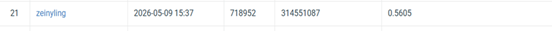

# NYCU  Computer Vision 2026 HW3

* **Student ID:** 314551087
* **Name:** 黃奕睿


## Introduction

This project focuses on instance segmentation for colored medical images. The goal is to detect, segment, and classify individual cells into four categories: class1–class4. Since cells may touch, overlap, or appear densely distributed, the model must separate each cell instance accurately.
The dataset contains 209 training/validation images and 101 test images in .tif format. Because the dataset is small, preprocessing, data augmentation, and model design are important for improving generalization.
The evaluation metric is AP50, which measures mask prediction quality at an IoU threshold of 0.5. Therefore, the model needs good classification, localization, and mask segmentation ability.
In this work, Mask R-CNN is used as the baseline. We compare it with CBAM Mask R-CNN, Cascade Mask R-CNN, PointRend Mask R-CNN, and PointRend Cascade Mask R-CNN. These models are evaluated to find the most suitable architecture under the constraints of no external data, pure vision-based models, and fewer than 200M trainable parameters.


## Environment Setup

### Dependencies

```bash
pip install -r requirements.txt
```

### Directory Structure

```
.
├── cbam_inference.py                       # inference cbam maskrcnn
├── cascade_inference.py                    # inference cascade maskrcnn
├── maskrcnn_inference.py                   # inference maskrcnn
├── pointrend_cascade_inference.py          # inference pointrend cascade maskrcnn
├── cbam_train.py                           # Training and validation cbam maskrcnn
├── cascade_train.py                        # Training and validation cascade maskrcnn
├── maskrcnn_train.py                       # Training and validation maskrcnn
├── pointrend_cascade_train.py              # Training and validation pointrend cascade maskrcnn
├── requirements.txt                        # Project dependencies
└── data/                                   # Dataset directory
```

## Usage

### Training

```bash
python maskrcnn_train.py 
```

### Configuration
```bash
# DATA PATH
TRAIN_IMG_DIR = "./dataset/train"
TRAIN_JSON = "./dataset/annotations/train.json"
VAL_IMG_DIR = "./dataset/val"
VAL_JSON = "./dataset/annotations/val.json"
```
Hyperparameter:
- `Optimizer`: AdamW
- `Weight Decay`: 1e-4
- `Learning rate`: 1e-4
- `Scheduler`: CosineAnnealingLR
- `Batch Size`: 2
- `Epochs`: 40
- `Validation Ratio`: 0.15
- `Mask Threshold`: 0.5
- `Evaluation Score Threshold`: 0.05
- `Minimum Instance Area`: 8

### Inference

```bash
python maskrcnn_inference.py
```
## Strategy and Adjustments

The following modifications and strategies are applied in the model and training process:

1. Apply horizontal flip and vertical flip for data augmentation. 
2. Update masks and bounding boxes after image flipping. 
3. Use ImageNet pretrained weights to improve feature extraction. 
4. Train the model with AdamW optimizer.
5. Use CosineAnnealingLR to adjust the learning rate.

## Additional experiments

### cbam maskrcnn
```bash
python cbam_train.py

python cbam_inference.py
```

### Deformable DETR
```bash
python train_deformable.py

python inference_deformable.py
```

### Deformable DETR
```bash
python train_deformable.py

python inference_deformable.py
```

## Performance

- Public test data AP50 :  0.5605

| Model | Best Val AP50 | Scores | Trainable parameters |
|------|------|------|------|
| Mask R-CNN | 0.4522 | 0.3300 | 43.72 M |
| Cbam Mask R-CNN | 0.4726| 0.3579 | 44.64 M |
| Cascade Mask R-CNN | 0.4944 | 0.3893 | 60.96 M |
| PointRend Cascade Mask R-CNN | 0.7736 | 0.5605 | 62.88M |

## Performance snapshot

