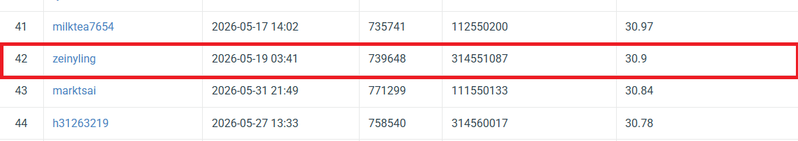

# NYCU  Computer Vision 2026 HW4

* **Student ID:** 314551087
* **Name:** 黃奕睿


## Introduction

In HW4, the task focuses on image restoration, where the goal is to recover clean images from degraded inputs. The dataset contains two types of degraded images: rain and snow. These weather degradations reduce visual quality and make the image harder to interpret.
The main requirement of this homework is to train one single model that can restore both rain-degraded and snow-degraded images. For each degraded training image, there is a corresponding clean image used as the target. The training and validation set includes 1600 degraded rain images, 1600 degraded snow images, and their matching clean images. The test set contains 100 degraded images, but their filenames only use simple numbers such as 0.png to 99.png, so the degradation type is not directly given.
In this task, we are required to use PromptIR as the restoration model. PromptIR is suitable for this problem because it is designed for all-in-one image restoration. Instead of building separate models for rain removal and snow removal, PromptIR uses prompt-based information to help one model adapt to different degradation types.
The final restored results are evaluated using PSNR (Peak Signal-to-Noise Ratio). A higher PSNR means that the restored image is closer to the clean ground truth image. The final submission should be saved as pred.npz, where each key is the original test image filename and each value is the restored image array with shape (3, H, W).


## Environment Setup

### Dependencies

```bash
pip install -r requirements.txt
```

### Directory Structure

```
.
├── train_V1.py           # Training baseline
├── train_V2.py           # Training V2
├── train_V3.py           # Training V3
├── train_V4.py           # Training V4 (best)
├── infer_V1.py           # inference baseline
├── infer_V2.py           # inference V2
├── infer_V3.py           # inference V3
├── infer_V4.py           # inference V4 (best)
├── requirements.txt      # Project dependencies
└── data/                 # Dataset directory
```

## Usage

### Training

```bash
python train_V4.py 
```

### Configuration
```bash
# DATA PATH
DATA_ROOT = "./hw4_realse_dataset"
TRAIN_DEGRADED_DIR = os.path.join(DATA_ROOT, "train", "degraded")
TRAIN_CLEAN_DIR = os.path.join(DATA_ROOT, "train", "clean")
```
Hyperparameter:
- `Image Size`: 256 × 256
- `Epochs`: 100
- `Batch Size`: 8
- `Learning Rate`: 1e-4
- `Weight Decay`: 1e-4
- `Validation Ratio`: 0.1
- `Optimizer`: AdamW
- `Scheduler`: CosineAnnealingLR
- `Loss Function`: Charbonnier Loss

### Inference

```bash
python infer_V4.py
```
## Strategy and Adjustments

The following modifications and strategies are applied in the model and training process:

1. Apply horizontal flip and vertical flip for data augmentation. 
2. Update masks and bounding boxes after image flipping. 
3. Use ImageNet pretrained weights to improve feature extraction. 
4. Train the model with AdamW optimizer.
5. Use CosineAnnealingLR to adjust the learning rate.

## Additional experiments

### cbam maskrcnn
```bash
python cbam_train.py                  # Train  

python cbam_inference.py              # inference
```

## Performance

- Public test data PSNR : 30.90

| Model | Best Val PSNR | Scores |
|------|------|------|
| PromptIR | 27.963 | 29.75 |
| PromptIR V2 | 28.455| 30.27 |
| PromptIR V3 | 29.799 | 30.69 |
| PromptIR V4 | 29.860 | 30.90 |

## Performance snapshot

